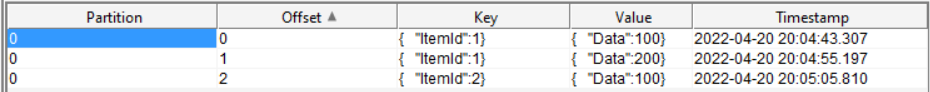

# KafkaSnapshot
Tool that allows to read current data snapshot from Apache Kafka topic to the file.

Supports:
* Compacting
* Key filtering
* Filtering with start and end offsets
* String keys (optionally as json) and long keys. Also Key field could be ignored (e.g. key is null or not exists it topic)
* Multi-partition topics
* SASL authentication mechanism
* Message sorting

By default messages should contains JSON data. Simple strings also supported (see ExportRawMessage parameter).


Config example:

```yaml
  "BootstrapServersConfiguration": {
    "BootstrapServers": [ "test" ],
    "Username": "user123",
    "Password": "pwd123",
    "SecurityProtocol": "SaslPlaintext",
    "SASLMechanism": "ScramSha512"
  },
  "TopicWatermarkLoaderConfiguration": {
    "AdminClientTimeout": "00:00:05"
  },
  "SnapshotLoaderConfiguration": {
    "DateOffsetTimeout": "00:00:05",
    "SearchSinglePartition": false
  },
  "LoaderToolConfiguration": {
    "UseConcurrentLoad": true,
    "GlobalMessageSort": "Time",
    "GlobalSortOrder": "Ask",
    "Topics": [
      {
        "Name": "topic1",
        "KeyType": "Json",
        "Compacting": "On",
        "ExportFileName": "topic1.json",
        "FilterKeyType": "Equals",
        "FilterKeyValue": "{\"value\": 1 }",
        "OffsetStartDate": "09.01.2021 12:12:12",
        "OffsetEndDate": "09.01.2021 14:12:12",
        "ExportRawMessage": true,
        "PartitionsIds": [ 0, 2 ]
      },
      {
        "Name": "topic2",
        "KeyType": "String",
        "Compacting": "Off",
        "ExportFileName": "topic2.json"
      },
      {
        "Name": "topic3",
        "KeyType": "Long",
        "Compacting": "Off",
        "ExportFileName": "topic3.json",
        "FilterKeyType": "Equals",
        "FilterKeyValue": 42
      },
      {
        "Name": "topic4",
        "KeyType": "Ignored",
        "Compacting": "Off",
        "ExportFileName": "topic4.json"
      },
      {
        "Name": "topic5",
        "KeyType": "String",
        "Compacting": "Off",
        "FilterKeyType": "Contains",
        "FilterKeyValue": "Test",
        "ExportRawMessage": true,
        "ExportFileName": "topic5.json"
      },
      {
        "Name": "topic6",
        "KeyType": "Long",
        "Compacting": "Off",
        "FilterKeyType": "LessOrEquals",
        "FilterKeyValue": 3,
        "ExportFileName": "topic6.json"
      },
      {
        "Name": "topic7",
        "KeyType": "Long",
        "Compacting": "Off",
        "FilterKeyType": "GreaterOrEquals",
        "FilterKeyValue": 3,
        "ExportFileName": "topic7.json"
      }
```
Config params:

| Parameter name | Description   |
| -------------- | ------------- |
| AdminClientTimeout | Cluster metadata loading timeout |
| DateOffsetTimeout | Searching offset by date timeout |
| SearchSinglePartition | Stops traversing partitions after the first partition with suitable data |
| BootstrapServers | List of kafka cluster servers, like "kafka-test:9092"  |
| Username | SASL username (optional)  |
| Password | SASL password (optional)  |
| SecurityProtocol | Protocol used to communicate with brokers (Plaintext,Ssl,SaslPlaintext,SaslSsl) (optional)  |
| SASLMechanism | SASL mechanism to use for authentication (Gssapi,Plain,ScramSha256,ScramSha512,OAuthBearer) (optional)  |
| UseConcurrentLoad | Loads data in concurrent mode or one by one |
| GlobalMessageSort | Message meta field for sorting (Time, Partition) (optional). Applies only for topics without Compacting. |
| GlobalSortOrder | GlobalMessageSort order (Ask, Desk, No) (optional). Applies only for topics without Compacting.|
| Name           | Apache Kafka topic name |
| KeyType        | Apache Kafka topic key representation (Json,String,Long,Ignored) |
| Compacting     | Use compacting by key or not (On,Off). Not supported for Ignored keyType |
| ExportFileName | File name for exported data  |
| FilterKeyType | Equals, Contains or None (optional)  |
| FilterKeyValue | Sample value for filtering (if FilterKeyType sets as 'Equals', 'Contains','GreaterOrEquals' or 'LessOrEquals') |
| OffsetStartDate | First message date (optional). Use to skip old messages in large topics. Format MM.DD.YYYY HH:MM:SS (Local timezone)|
| OffsetEndDate | Message date top limit (optional). Use to limit filtering messages in large topics. Format MM.DD.YYYY HH:MM:SS (Local timezone)|
| ExportRawMessage | If true - export will write message as raw string without converting to formatted json (optional)|
| PartitionsIds | Partitions ids filter (optional)|

Filter restrictions:
* 'Contains' key filter could be applied only to string keys.
* 'GreaterOrEquals' and 'LessOrEquals' filters could be applied only to long keys.


Exported file example:




```json
[
  {
    "Key": {
      "ItemId": 1
    },
    "Value": {
      "Data": 100
    },
    "Meta": {
      "Timestamp": "2022-04-20T17:04:43.307Z",
      "Partition": 0,
      "Offset": 0
    }
  },
  {
    "Key": {
      "ItemId": 1
    },
    "Value": {
      "Data": 200
    },
    "Meta": {
      "Timestamp": "2022-04-20T17:04:55.197Z",
      "Partition": 0,
      "Offset": 1
    }
  },
  {
    "Key": {
      "ItemId": 2
    },
    "Value": {
      "Data": 100
    },
    "Meta": {
      "Timestamp": "2022-04-20T17:05:05.81Z",
      "Partition": 0,
      "Offset": 2
    }
  }
]
```

Exported file json description:
| Field name | Description   |
| -------------- | ------------- |
| Key           | Kafka message key (optional) |
| Value           | Kafka message value |
| Meta           | Kafka message metadata |
| Meta.Timestamp | Kafka message creation timestamp |
| Meta.Partition | Kafka message partition |
| Meta.Offset | Kafka message partition offset |

