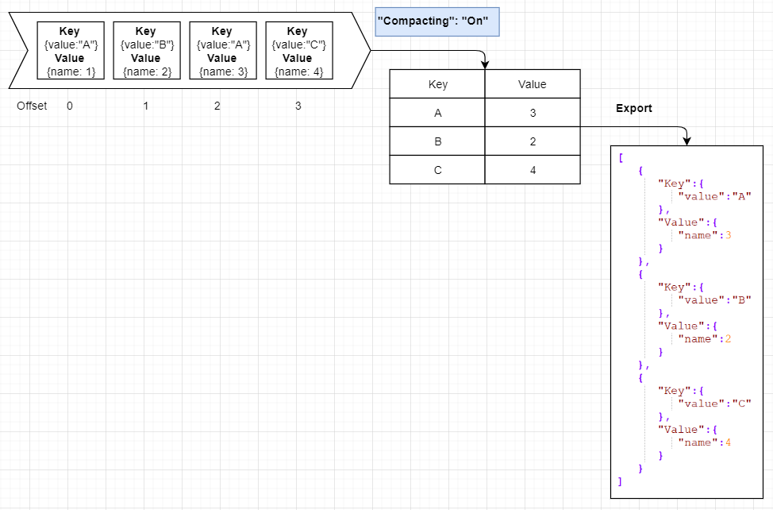

# KafkaSnapshot
Tool that allows to read current data snapshot from Apache Kafka topic to the file.

Supports:
* Compacting
* Key filtering
* Searching start offset for the given date and time
* String keys (optionally as json) and long keys
* Multi-partition topics

Messages should contains JSON data.



Config with topics for export:

```yaml
  "BootstrapServersConfiguration": {
    "BootstrapServers": [
    ]
  },
  "TopicWatermarkLoaderConfiguration": {
    "AdminClientTimeout": "00:00:05"
  },
  "LoaderToolConfiguration": {
    "UseConcurrentLoad": true,
    "Topics": [
      {
        "Name": "topic1",
        "KeyType": "Json",
        "Compacting": "On",
        "ExportFileName": "topic1.json",
        "FilterType": "Equals",
        "FilterValue": "{\"value\": 1 }",
        "OffsetStartDate": "09.01.2021 12:12:12",
        "ExportRawMessage": true
      },
      {
        "Name": "topic2",
        "KeyType": "String",
        "Compacting": "Off",
        "ExportFileName": "topic2.json"
      },
      {
        "Name": "topic3",
        "KeyType": "Long",
        "Compacting": "Off",
        "ExportFileName": "topic3.json",
        "FilterType": "Equals",
        "FilterValue": 42
      }
    ]
  }
```

| Parameter name | Description   |
| -------------- | ------------- |
| AdminClientTimeout | Cluster metadata loading timeout |
| BootstrapServers | List of kafka cluster servers, like "kafka-test:9092"  |
| UseConcurrentLoad | Loads data in concurrent mode or one by one |
| Name           | Apache Kafka topic name |
| KeyType        | Apache Kafka topic key representation (Json,String,Long) |
| Compacting     | Use compacting by key or not (On,Off) |
| ExportFileName | File name for exported data  |
| FilterType | Equals or None (optional)  |
| FilterValue | Sample value for filtering (if FilterType sets as 'Equals') |
| OffsetStartDate | First message date (optional). Use to skip old messages in large topics.|
| ExportRawMessage | If true - export will write message as raw string without converting to formatted json (optional).|
