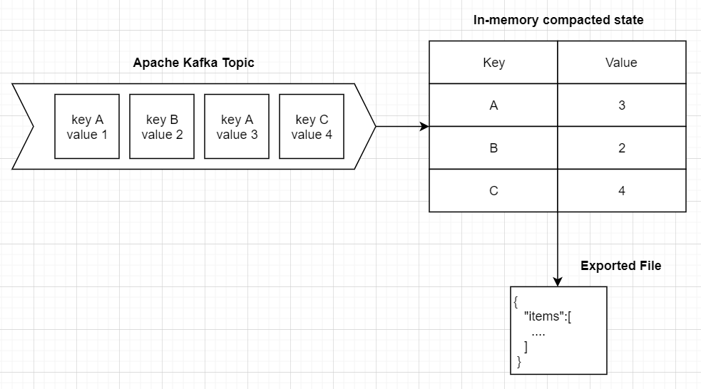

# KafkaSnapshot
Tool that allows to read current data snapshot from Apache Kafka topic with compacting.

Current version is optimized for string keys and json messages and skips topics with NULL keys.



Config with topics for export

```yaml
  "LoaderToolConfiguration": {
    "MetadataTimeout": 1000,
    "BootstrapServers": [
    ],
    "Topics": [
    ]
  }
```
