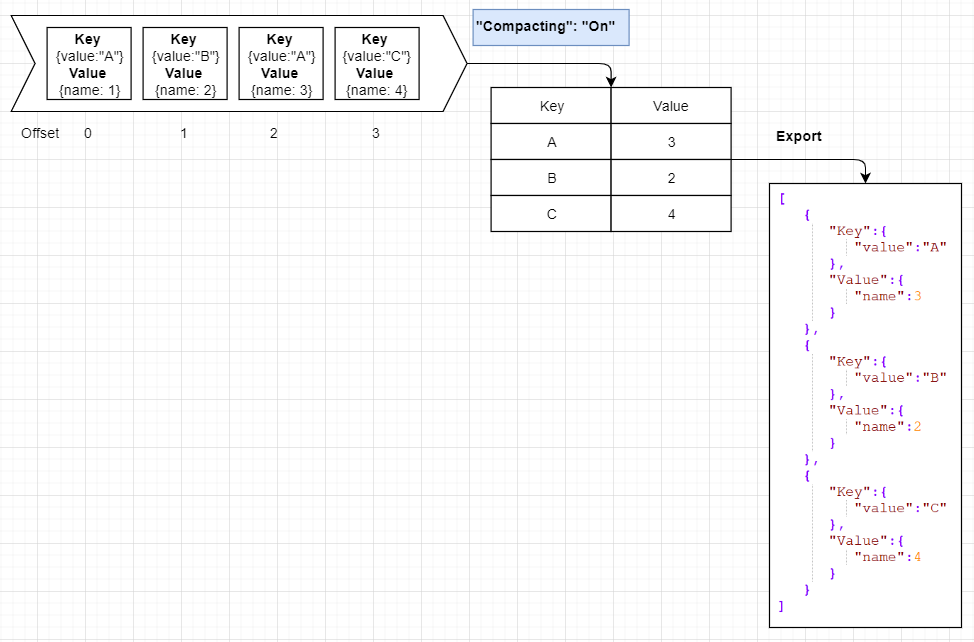
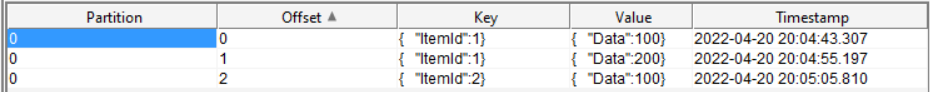

# KafkaSnapshot
Tool that allows reading the current data snapshot from an Apache Kafka topic to a file.

## Requirements

* .NET 10 SDK

## Build and test

The repository uses the modern `.slnx` solution format.

```powershell
dotnet restore src\KafkaSnapshot.slnx
dotnet build src\KafkaSnapshot.slnx --no-restore
dotnet test src\KafkaSnapshot.slnx --no-build
```

## Run

Update `src\Utility\appsettings.json`, then run the utility project:

```powershell
dotnet run --project src\Utility\Utility.csproj
```

The optional JSON schema for editors is available at
`src\Utility\appsettings.schema.json`.

## Migration notes

Recent versions use `DateTimeOffset` for date-based offsets and exported metadata timestamps.

* `OffsetStartDate` and `OffsetEndDate` should be configured as ISO 8601 strings with an explicit UTC designator or offset, for example `2021-09-01T12:12:12Z` or `2021-09-01T14:12:12+02:00`.
* `KafkaMetadata.Timestamp` is now a `DateTimeOffset`.
* `DateFilterRange.StartDate`, `DateFilterRange.EndDate`, `LoadingTopic.OffsetDate`, `LoadingTopic.EndOffsetDate`, `TopicConfiguration.OffsetStartDate`, and `TopicConfiguration.OffsetEndDate` are now `DateTimeOffset` values.
* `PartitionWatermark.TopicName` was renamed to `PartitionWatermark.Topic` because it stores the full loading topic configuration, not only the topic name.

Supports:
* Compacting
* Key filtering
* Filtering with start and end offsets
* String keys (optionally as JSON) and long keys. The key field can also be ignored (for example, when the key is null or does not exist in the topic).
* Multi-partition topics
* SASL authentication mechanism
* Message sorting
* MessagePack payloads with automatic conversion to JSON arrays.
* Message converting to Base64

By default, messages should contain JSON data. Simple strings are also supported (see the `ExportRawMessage` parameter).



Config example:

```json
{
  "BootstrapServersConfiguration": {
    "BootstrapServers": [ "test" ],
    "Username": "user123",
    "Password": "pwd123",
    "SecurityProtocol": "SaslPlaintext",
    "SASLMechanism": "ScramSha512"
  },
  "TopicWatermarkLoaderConfiguration": {
    "AdminClientTimeout": "00:00:05"
  },
  "SnapshotLoaderConfiguration": {
    "DateOffsetTimeout": "00:00:05",
    "SearchSinglePartition": false,
    "MaxConcurrentPartitions": 4
  },
  "JsonFileDataExporterConfiguration": {
    "UseFileStreaming": true,
    "OutputDirectory": "snapshots"
  },
  "LoaderToolConfiguration": {
    "UseConcurrentLoad": true,
    "GlobalMessageSort": "Time",
    "GlobalSortOrder": "Ask",
    "Topics": [
      {
        "Name": "topic1",
        "KeyType": "Json",
        "Compacting": "On",
        "ExportFileName": "topic1.json",
        "FilterKeyType": "Equals",
        "FilterKeyValue": "{\"value\": 1 }",
        "OffsetStartDate": "2021-09-01T12:12:12Z",
        "OffsetEndDate": "2021-09-01T14:12:12+02:00",
        "ExportRawMessage": true,
        "PartitionsIds": [ 0, 2 ]
      },
      {
        "Name": "topic2",
        "KeyType": "String",
        "Compacting": "Off",
        "ExportFileName": "topic2.json"
      },
      {
        "Name": "topic3",
        "KeyType": "Long",
        "Compacting": "Off",
        "ExportFileName": "topic3.json",
        "FilterKeyType": "Equals",
        "FilterKeyValue": 42
      },
      {
        "Name": "topic4",
        "KeyType": "Ignored",
        "Compacting": "Off",
        "ExportFileName": "topic4.json"
      },
      {
        "Name": "topic5",
        "KeyType": "String",
        "Compacting": "Off",
        "FilterKeyType": "Contains",
        "FilterKeyValue": "Test",
        "ExportRawMessage": true,
        "ExportFileName": "topic5.json"
      },
      {
        "Name": "topic6",
        "KeyType": "Long",
        "Compacting": "Off",
        "FilterKeyType": "LessOrEquals",
        "FilterKeyValue": 3,
        "ExportFileName": "topic6.json"
      },
      {
        "Name": "topic7",
        "KeyType": "Long",
        "Compacting": "Off",
        "FilterKeyType": "GreaterOrEquals",
        "FilterKeyValue": 3,
        "ExportFileName": "topic7.json"
      },
      {
        "Name": "topic8",
        "KeyType": "Long",
        "ExportFileName": "topic8.json",
        "MessageEncoderRule": "MessagePack"
      },
      {
        "Name": "topic9",
        "KeyType": "Long",
        "ExportFileName": "topic9.json",
        "MessageEncoderRule": "MessagePackLz4Block"
      },
      {
        "Name": "topic10",
        "KeyType": "Long",
        "ExportRawMessage": true,
        "MessageEncoderRule": "Base64",
        "ExportFileName": "topic10.json"
      }
    ]
  }
}
```
Configuration parameters:

| Parameter name | Description                                                                                                                                                             |
| -------------- |-------------------------------------------------------------------------------------------------------------------------------------------------------------------------|
| AdminClientTimeout | Cluster metadata loading timeout                                                                                                                                        |
| DateOffsetTimeout | Searching offset by date timeout                                                                                                                                        |
| SearchSinglePartition | Stops traversing partitions after the first partition with suitable data                                                                                                |
| MaxConcurrentPartitions | Maximum number of topic partitions processed concurrently (optional). If omitted, all partitions are processed concurrently.                                           |
| BootstrapServers | List of kafka cluster servers, like "kafka-test:9092"                                                                                                                   |
| Username | SASL username (optional)                                                                                                                                                |
| Password | SASL password (optional)                                                                                                                                                |
| SecurityProtocol | Protocol used to communicate with brokers (Plaintext,Ssl,SaslPlaintext,SaslSsl) (optional)                                                                              |
| SASLMechanism | SASL mechanism to use for authentication (Gssapi,Plain,ScramSha256,ScramSha512,OAuthBearer) (optional)                                                                  |
| UseConcurrentLoad | Loads data in concurrent mode or one by one                                                                                                                             |
| GlobalMessageSort | Message meta field for sorting (Time, Partition) (optional). Applies only for topics without Compacting.                                                                |
| GlobalSortOrder | GlobalMessageSort order (Ascending, Descending, None) (optional). Legacy aliases Ask, Desk, and No are still supported. Applies only for topics without Compacting.    |
| Name           | Apache Kafka topic name                                                                                                                                                 |
| KeyType        | Apache Kafka topic key representation (Json,String,Long,Ignored)                                                                                                        |
| Compacting     | Use compacting by key or not (On,Off). Not supported for Ignored keyType                                                                                                |
| ExportFileName | File name for exported data                                                                                                                                             |
| FilterKeyType | Equals, Contains or None (optional)                                                                                                                                     |
| FilterKeyValue | Sample value for filtering (if FilterKeyType sets as 'Equals', 'Contains','GreaterOrEquals' or 'LessOrEquals')                                                          |
| OffsetStartDate | First message date (optional). Use to skip old messages in large topics. Use ISO 8601 with an explicit offset, for example `2021-09-01T12:12:12Z` or `2021-09-01T14:12:12+02:00`. |
| OffsetEndDate | Message date top limit (optional). Use to limit filtering messages in large topics. Use ISO 8601 with an explicit offset, for example `2021-09-01T12:12:12Z` or `2021-09-01T14:12:12+02:00`. |
| ExportRawMessage | If true, export writes messages as raw strings without converting them to formatted JSON (optional)                                                                     |
| PartitionsIds | Partitions ids filter (optional)                                                                                                                                        |
| UseFileStreaming | Serializes loaded data to file directly via FileStream (Avoids OOM issue for large amounts of data). Better effect with disabled sorting (GlobalSortOrder No)           |
| OutputDirectory | Directory for exported files (optional). If omitted, files are written to the current working directory.                                                                |
|MessageEncoderRule| Allows you to choose the format in which the message body is received. By default, a String is expected, but you can choose MessagePack, MessagePackLz4Block or Base64. |

Filter restrictions:
* The 'Contains' key filter can be applied only to string keys.
* The 'GreaterOrEquals' and 'LessOrEquals' filters can be applied only to long keys.


Exported file example:




```json
[
  {
    "Key": {
      "ItemId": 1
    },
    "Value": {
      "Data": 100
    },
    "Meta": {
      "Timestamp": "2022-04-20T17:04:43.307Z",
      "Partition": 0,
      "Offset": 0
    }
  },
  {
    "Key": {
      "ItemId": 1
    },
    "Value": {
      "Data": 200
    },
    "Meta": {
      "Timestamp": "2022-04-20T17:04:55.197Z",
      "Partition": 0,
      "Offset": 1
    }
  },
  {
    "Key": {
      "ItemId": 2
    },
    "Value": {
      "Data": 100
    },
    "Meta": {
      "Timestamp": "2022-04-20T17:05:05.81Z",
      "Partition": 0,
      "Offset": 2
    }
  }
]
```

Exported file JSON format:
| Field name | Description   |
| -------------- | ------------- |
| Key           | Kafka message key (optional) |
| Value           | Kafka message value |
| Meta           | Kafka message metadata |
| Meta.Timestamp | Kafka message creation timestamp |
| Meta.Partition | Kafka message partition |
| Meta.Offset | Kafka message partition offset |

